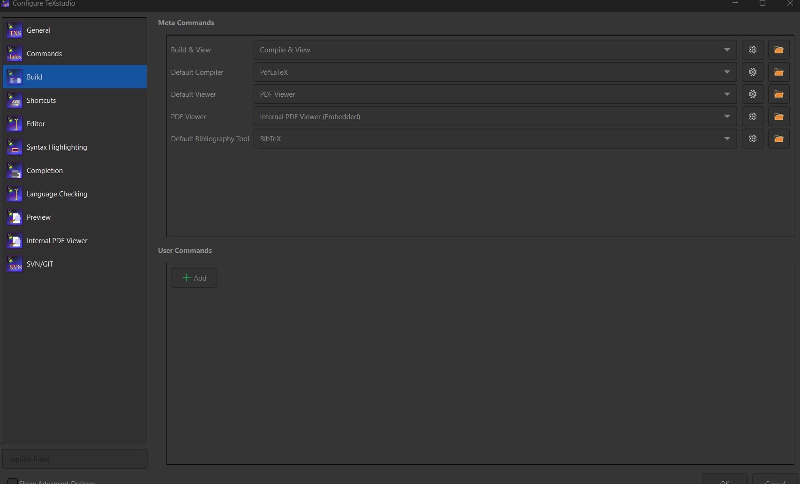

# Thesis of ecommerce and kubernetes

This project is used to render Latex thesis

## Setup

User need to install [**Tex Studio**](https://www.texstudio.org/) to run this project.

After installing [**Tex Studio**](https://www.texstudio.org/), user need to setup the config at **Options > Configure TeXstudio...** as the following:

## Git convention

### Branch name

Each developer has to create their own branch to work on their own user story, and does not allow to push their code directly to `dev`.

Each branch has to follow this naming convention: `<purpose name>/<user story number>-action-you-going-to-do`
Example: `docs/US123-add-new-documents`.

The purpose of each branch has to be one of these values: 
- `docs`: adding new content.
- `mod`: modify the existing content.

The **user story number** **MUST** be the number of US you are working on. For the modifying activity, the US number should be the number of US for that activity (if that US exists), or the number of US that you modify.

### Pull request name

Developers want to make change to `dev`, they need to create pull request to merge their work to the `dev` branch.

Each pull request **MUST** following this naming convention: `<purpose name>: [<user story number>] action you going to do.` 
Example: `docs: [US123] add new documents to the beginning section`.

The ***purpose name*** and ***user story number*** **MUST** be the same with the one the developer used to name their branch.

The description for the PR should be more detailed than the one in the branch's name.

### Merging PRs

#### Approvals

Each pull request needs to have **2 approvals** before merging into `dev`.

The number of approvals will be reset whenever the owner push a new commit to remote.

#### Merging action

All PRs **MUST** `Squash and merge` to the `dev` branch. The commit messgae has to be the same as the PR's name.
